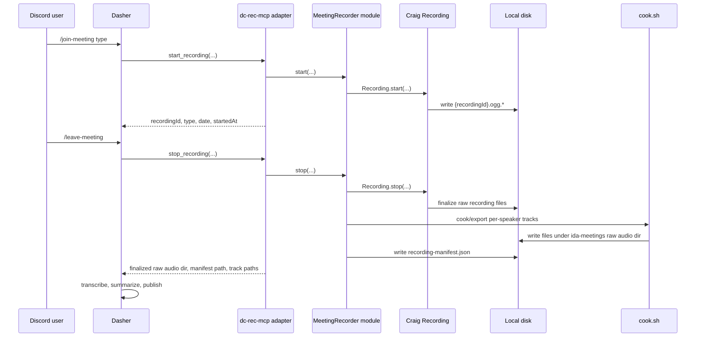

# dc-rec-mcp Planning RFC

## Goal

Build a Discord voice-channel recording MCP that lets an external client, currently Dasher, start, stop, and export local multitrack meeting recordings without the current manual Craig download-link handoff.

`dc-rec-mcp` is responsible only for Discord voice recording, finalization, local audio export, and structured metadata. Dasher is responsible for command routing, transcription, summarization, Discord replies, and optional Git publishing.

This RFC is based on the Craig codebase guide, the current Craig recording and cooking entry points, and the external Dasher integration contract from 2026-06-29.

## External Dasher Contract

Claude Code should not implement, configure, or reason about Dasher internals. Treat Dasher as an external caller of MCP tools.

The external caller will provide:

- `guildId`
- `voiceChannelId`
- `textChannelId`
- `requestedByUserId`
- `type`
- `date`
- optional `title`

`dc-rec-mcp` must write finalized per-speaker audio files and a manifest to a configured local output root. The first target output shape is compatible with Dasher's current meeting repository:

```text
<output-root>/<YYYY-MM>/<type>/raw audio/<YYYY-MM-DD>/
  01-<userId>-<displayName>.ogg
  02-<userId>-<displayName>.ogg
  recording-manifest.json
```

After `dc-rec-mcp` returns that directory and manifest, Dasher handles transcription, summary generation, Discord delivery, and any repository commits or pushes.

## Current Manual Workflow

1. A user runs Craig `/join` in Discord.
2. Craig joins the voice channel and records each speaker into a separate track.
3. A user runs Craig `/leave` or `/stop`.
4. Craig provides a download page link.
5. The user opens the link, chooses a multitrack audio download, and copies the download URL.
6. The user mentions Dasher in Discord and includes the audio download URL.
7. Dasher downloads the audio, transcribes it, creates meeting notes, replies in Discord, and pushes data to GitHub.

## Target Workflow

1. A user triggers Dasher's meeting-start command, selecting a meeting type such as `stand-up`, `weekly`, `research`, `meeting`, `sharing`, `retro`, or `others`.
2. Dasher provides this request context to MCP:
   - guild ID
   - text channel ID
   - voice channel ID
   - requester user ID
   - meeting type
   - meeting date
   - optional title
3. Dasher calls `dc-rec-mcp.start_recording`.
4. `dc-rec-mcp` joins the voice channel and records multitrack audio using Craig's existing recording implementation.
5. A user triggers Dasher's meeting-stop command.
6. Dasher calls `dc-rec-mcp.stop_recording`.
7. `dc-rec-mcp` finalizes the recording into a transcript-ready local directory under the configured output root.
8. Dasher transcribes the local per-speaker tracks using its configured transcription flow.
9. Dasher maps speakers using track metadata from `recording-manifest.json`.
10. Dasher creates a meeting summary, sends markdown back to Discord, and performs Git publishing only when requested.

## Craig Facts This Plan Relies On

Craig already has the hard recording implementation:

- `apps/bot/src/modules/recorder/recording.ts` owns one recording's state machine.
- `Recording.start()` creates `{recordingId}.ogg.info`, starts voice receive, and writes metadata.
- `Recording.stop()` leaves the voice channel, flushes buffered packets, ends the writer, and marks `endedAt`.
- `apps/bot/src/modules/recorder/writer.ts` writes Craig's custom multitrack OGG files.
- The file contract is `{recordingId}.ogg.{info,header1,header2,data,users,log}`.
- `apps/download/api/src/util/cook.ts` wraps `cook.sh` to export user-facing audio formats.
- `cook.sh` is the existing pipeline for converting Craig's custom multitrack recording files into standard audio containers.

The important design implication is that `dc-rec-mcp` should reuse Craig's recording and cooking implementation instead of reimplementing Discord voice receive, OGG page writing, or track alignment.

## Craig Fork Implementation Brief

The fork should preserve the parts that already solve hard audio problems and remove public-service assumptions around them.

Keep or extract:

- `apps/bot/src/modules/recorder/recording.ts`
- `apps/bot/src/modules/recorder/writer.ts`
- `apps/bot/src/modules/recorder/ogg.ts`
- `apps/bot/src/modules/recorder/util.ts`
- the minimal Discord client setup needed to join voice channels
- `cook.sh`
- `cook/oggcorrect.c`
- `cook/oggtracks.c`
- `cook/oggduration.c`
- `cook/raw-partwise.sh`
- any `cook/` helpers required by per-speaker Ogg Opus export

Avoid carrying into the first version:

- Craig download web app
- dashboard
- OAuth and cloud-drive upload flows
- Patreon entitlement checks
- public download URL generation
- DM download messages
- public recording retention policy
- sharding unless one bot process cannot cover the target servers

The first implementation pass should make Craig's recording implementation callable from a local module, not from a slash command. The existing `join.ts` and `stop.ts` files are useful behavior references, but they should not be the new integration point.

### Code Hotspots

Use these files as the first reading path during implementation:

1. `apps/bot/src/commands/join.ts`
   - reference for guild/channel checks, permission checks, existing recording guard, and `Recording.start`.
2. `apps/bot/src/commands/stop.ts`
   - reference for permission checks and `Recording.stop`.
3. `apps/bot/src/modules/recorder/index.ts`
   - reference for active recording map, recording path setup, and stale recording cleanup.
4. `apps/bot/src/modules/recorder/recording.ts`
   - core recording lifecycle.
5. `apps/bot/src/modules/recorder/writer.ts`
   - raw file writing contract.
6. `apps/download/api/src/util/cook.ts`
   - reference for allowed formats and `cook.sh` process management.
7. `apps/download/api/src/util/recording.ts`
   - reference for `.ogg.info` and `.ogg.users` parsing.

### First Refactor Target

Create a local module with an interface shaped like:

```ts
type RecorderRuntime = {
  discordClient: unknown;
  recordingDir: string;
  maxBytes: number;
  maxRecordingHours: number;
  logger: Logger;
};

class MeetingRecorder {
  constructor(runtime: RecorderRuntime, stateStore: MeetingStateStore, exporter: RecordingExporter) {}
}
```

The point is not this exact constructor. The point is that `MeetingRecorder` accepts dependencies instead of creating them, so tests can use fake Discord, Craig, and export adapters.

## Proposed Ownership

The external caller owns the meeting workflow.

The external caller should keep responsibility for:

- Discord slash commands for meetings
- meeting type selection
- deciding when to call MCP tools
- transcription model selection
- prompt selection
- markdown summary generation
- Discord reply behavior
- GitHub publishing

`dc-rec-mcp` owns local recording and export.

`dc-rec-mcp` should keep responsibility for:

- connecting to the requested Discord voice channel
- recording each speaker to a separate track
- stopping and finalizing a recording
- exposing recording status
- exporting local transcript-ready audio files
- returning track metadata to the caller

Craig public-service features should be removed, disabled, or deferred unless they are needed for local meeting recording:

- download web page
- dashboard
- Patreon entitlements
- cloud drive upload
- public download links
- public recording expiry policies

## Main Seam

Create a deep `MeetingRecorder` module and put the MCP adapter outside it.

The interface should be small:

```ts
interface MeetingRecorder {
  start(input: StartRecordingInput): Promise<StartedRecording>;
  status(input: RecordingRef): Promise<RecordingStatus>;
  stop(input: StopRecordingInput): Promise<FinalizedRecording>;
  export(input: ExportRecordingInput): Promise<ExportedRecording>;
}
```

The implementation hides:

- Eris voice connection details
- Craig `Recording` lifecycle details
- active recording lookup
- writer finalization
- Craig custom recording files
- `cook.sh` execution
- output path construction
- track/user metadata parsing

The MCP server should be an adapter over this interface, not the place where recording behavior lives.

## Architecture Sketch



The external seam is the MCP tool interface. The internal seam is `MeetingRecorder`, which should be directly testable without speaking MCP JSON.

## MCP Tool Interface

### `start_recording`

Starts recording a Discord voice channel.

Input:

```json
{
  "guildId": "string",
  "voiceChannelId": "string",
  "requesterUserId": "string",
  "textChannelId": "string",
  "type": "stand-up | weekly | research | meeting | sharing | retro | others",
  "date": "YYYY-MM-DD",
  "title": "optional string",
  "recordingId": "optional string"
}
```

Output:

```json
{
  "recordingId": "string",
  "state": "recording",
  "type": "stand-up",
  "date": "YYYY-MM-DD",
  "title": "optional string",
  "startedAt": "ISO timestamp",
  "statusPath": "absolute local path"
}
```

Rules:

- One active recording per guild for the first version, matching the current local recorder singleton model.
- If a guild already has an active recording, return a typed `already_recording` error with the active `recordingId`.
- The tool should return after recording has started, not after the meeting ends.

### `status_recording`

Returns current state for polling and recovery.

Input:

```json
{
  "recordingId": "optional string",
  "guildId": "optional string"
}
```

Output:

```json
{
  "recordingId": "optional string",
  "state": "idle | connecting | recording | stopping | finalized | errored",
  "type": "optional string",
  "date": "optional YYYY-MM-DD",
  "title": "optional string",
  "startedAt": "optional ISO timestamp",
  "endedAt": "optional ISO timestamp",
  "bytesWritten": "optional number",
  "tracksSoFar": [
    {
      "userId": "string",
      "displayName": "optional string",
      "username": "optional string",
      "path": "optional absolute local path"
    }
  ],
  "lastError": "optional string"
}
```

### `stop_recording`

Stops and finalizes an active recording.

Input:

```json
{
  "recordingId": "optional string",
  "guildId": "optional string",
  "stoppedByUserId": "optional string"
}
```

Output:

```json
{
  "recordingId": "string",
  "status": "finalized",
  "type": "stand-up",
  "date": "YYYY-MM-DD",
  "title": "optional string",
  "guildId": "string",
  "voiceChannelId": "string",
  "textChannelId": "string",
  "requestedByUserId": "string",
  "startedAt": "ISO timestamp",
  "endedAt": "ISO timestamp",
  "rawAudioDir": "absolute local path",
  "tracks": [
    {
      "userId": "string",
      "displayName": "string",
      "username": "string",
      "path": "absolute local path",
      "codec": "opus",
      "container": "ogg",
      "sampleRate": 48000,
      "channels": 2,
      "startedAt": "optional ISO timestamp",
      "endedAt": "optional ISO timestamp"
    }
  ],
  "manifestPath": "absolute local path"
}
```

Rules:

- The tool must wait until Craig's writer is fully closed.
- The tool should return a transcript-ready local directory, not just a Craig internal recording ID.
- The preferred first output format is per-speaker Ogg Opus tracks because the existing `ida-meetings` recorder already produces `.ogg` tracks and transcript sections are filename-based.

### `export_recording`

Optional tool for re-exporting a finalized recording to another local format.

Input:

```json
{
  "recordingId": "string",
  "format": "ogg-opus | flac | wav | mp3 | m4a",
  "container": "directory | zip",
  "mode": "multitrack | mixdown",
  "outputDir": "optional absolute local path"
}
```

Output:

```json
{
  "recordingId": "string",
  "format": "ogg-opus",
  "container": "directory",
  "mode": "multitrack",
  "outputPath": "absolute local path",
  "tracks": [
    {
      "trackNo": 1,
      "userId": "string",
      "username": "string",
      "displayName": "optional string",
      "filePath": "absolute local path"
    }
  ]
}
```

Recommended first version:

- `format: "ogg-opus"`
- `container: "directory"`
- `mode: "multitrack"`

This preserves speaker identity and matches the current external handoff expectations. FLAC/WAV export can be added if the downstream transcription flow proves more reliable with those formats.

## Local File Layout

Use the `ida-meetings` repository as the canonical completed-audio destination:

```text
ida-meetings/
  <YYYY-MM>/
    <type>/
      raw audio/
        <YYYY-MM-DD>/
          01-<userId>-<displayName>.ogg
          02-<userId>-<displayName>.ogg
          recording-manifest.json
```

Keep Craig's internal raw files in a separate runtime directory:

```text
dc-rec-runtime/
  raw/
    {recordingId}.ogg.info
    {recordingId}.ogg.header1
    {recordingId}.ogg.header2
    {recordingId}.ogg.data
    {recordingId}.ogg.users
    {recordingId}.ogg.log
  sessions/
    {recordingId}/
      state.json
      recorder.log
```

`recording-manifest.json` should be the stable handoff contract for Dasher:

```json
{
  "recordingId": "string",
  "status": "finalized",
  "type": "stand-up",
  "date": "YYYY-MM-DD",
  "title": "stand-up",
  "guildId": "string",
  "voiceChannelId": "string",
  "textChannelId": "string",
  "requestedByUserId": "string",
  "startedAt": "ISO timestamp",
  "endedAt": "ISO timestamp",
  "rawAudioDir": "absolute local path",
  "tracks": [
    {
      "userId": "string",
      "displayName": "string",
      "username": "string",
      "path": "absolute local path",
      "codec": "opus",
      "container": "ogg",
      "sampleRate": 48000,
      "channels": 2,
      "startedAt": "optional ISO timestamp",
      "endedAt": "optional ISO timestamp"
    }
  ]
}
```

This shape fits the existing `meeting-audio` and `meeting-recorder` conventions:

- Dasher already expects local files under `ida-meetings/<YYYY-MM>/<type>/raw audio/<YYYY-MM-DD>/`.
- Existing transcripts use filename sections such as `## 01-01-littleair1019.ogg`.
- Speaker mapping improves when filenames and manifest include Discord user IDs and display names.

## State Persistence

Use a file-based JSON state store, matching the existing `ida-meetings/tools/meeting-recorder/runtime/` model.

State to persist:

- `recordingId`
- `guildId`
- `voiceChannelId`
- `textChannelId`
- `requestedByUserId`
- `type`
- `date`
- `title`
- `state`
- `startedAt`
- `endedAt`
- `rawCraigRecordingBase`
- `rawAudioDir`
- `manifestPath`
- `lastError`

Preferred state layout:

```text
dc-rec-runtime/
  state.json
  sessions/
    <recordingId>/
      state.json
      recorder.log
```

Reason: `start_recording` should return quickly while the long-running voice recorder continues in the background. `status_recording` and `stop_recording` can inspect state files and process liveness, which matches the current local recorder pattern.

## Runtime Configuration

Use explicit environment variables for the first version. Avoid relying on Craig's public-service config shape unless a setting is still genuinely shared.

Recommended settings:

```text
DC_REC_DISCORD_TOKEN=...
DC_REC_DISCORD_APPLICATION_ID=...
DC_REC_RUNTIME_DIR=/absolute/path/to/dc-rec-runtime
DC_REC_OUTPUT_ROOT=/absolute/path/to/ida-meetings
DC_REC_COOK_PATH=/absolute/path/to/craig/cook.sh
DC_REC_MAX_RECORDING_HOURS=6
DC_REC_MAX_BYTES=536870912
DC_REC_DEFAULT_EXPORT_FORMAT=ogg-opus
DC_REC_DEFAULT_EXPORT_MODE=multitrack
DC_REC_LOG_LEVEL=info
```

Optional later settings:

```text
DC_REC_CLEANUP_RAW_AFTER_DAYS=30
DC_REC_LOCAL_FILE_SERVER_ENABLED=false
DC_REC_LOCAL_FILE_SERVER_PORT=0
```

Configuration rules:

- `DC_REC_RUNTIME_DIR` and `DC_REC_OUTPUT_ROOT` must be absolute paths.
- The MCP process must be able to write Craig runtime files and canonical raw audio outputs.
- The external caller must be able to read the canonical raw audio directory.
- `DC_REC_COOK_PATH` should be validated at startup, with a clear `cook_binary_missing` startup diagnostic if missing.
- Discord credentials should belong to `dc-rec-mcp` in the first version. Reusing another bot's token is an external deployment decision.

## Runtime Topology

Preferred first topology:

```text
Same host:
  external caller process
  dc-rec-mcp process
  configured output root
    <YYYY-MM>/<type>/raw audio/<YYYY-MM-DD>/
  dc-rec-runtime/
```

Reason: local file paths are the simplest way to remove the manual download-link step.

If Dasher and `dc-rec-mcp` run on different hosts, introduce one of these adapters later:

- shared mounted storage
- local-only HTTP file server exposed only to Dasher
- object storage upload adapter

Those should be adapters over the export result. They should not change `MeetingRecorder`.

## Risks And Mitigations

### Risk: Craig code assumes public-service infrastructure

Craig currently has PostgreSQL, Redis, dashboard, tasks, and public download assumptions. Pulling all of that into `dc-rec-mcp` would make the first version larger than needed.

Mitigation:

- keep a local state store for meeting recording workflow state
- keep Craig raw file format as the recorder/export contract
- remove or stub entitlement, cloud, and download features in the MCP fork

### Risk: Craig export may not produce Dasher-ready Ogg tracks directly

Craig's download flow commonly creates ZIP or streamed output. The desired handoff is a Dasher-ready directory of per-speaker `.ogg` files plus `recording-manifest.json`.

Mitigation:

- prefer direct per-track Ogg Opus output if Craig's raw/cook helpers can produce it cleanly
- otherwise implement ZIP export as an internal step, then extract/rename tracks into the canonical raw audio directory
- keep the MCP result stable by returning `recording-manifest.json` and track paths regardless of the internal export path

### Risk: local path mismatch between caller and MCP

The external caller expects local files under a configured output root. If `dc-rec-mcp` runs on another host or sees a different mount path, the caller may not be able to consume returned paths.

Mitigation:

- run `dc-rec-mcp` on the same machine as the caller for the first version
- configure `DC_REC_OUTPUT_ROOT` explicitly
- if process or host separation is required later, add shared storage or a local-only file server adapter

### Risk: active recording recovery is hard

If `dc-rec-mcp` crashes during an active voice recording, the live Discord connection is gone even if raw files remain.

Mitigation:

- first version documents active-recording recovery as limited
- finalized recordings remain recoverable from raw files and state store
- the caller should surface a clear "recording interrupted" message if status becomes `errored`

### Risk: speaker timestamps need more than per-track files

Per-track transcription preserves speaker identity, but merging into a single chronological transcript may require timestamps from the transcription provider.

Mitigation:

- the downstream transcription flow should request timestamped segments per track
- manifest should carry track and user metadata
- the caller owns transcript merge policy because it owns summarization prompts

### Risk: Discord bot identity conflict

There are currently multiple bots in the server. `dc-rec-mcp` can use its own bot identity or a deployment-provided token, but those have different operational implications.

Mitigation:

- first plan assumes `dc-rec-mcp` has its own Discord token
- the caller still owns slash commands
- if another bot identity is reused, treat that as a deployment decision outside the MCP implementation

### Risk: downstream summarization is unavailable

The downstream transcription and summary flow is outside `dc-rec-mcp`. It may be missing, misconfigured, or unavailable in the target runtime.

Mitigation:

- treat transcription/summary execution as caller responsibility
- make `dc-rec-mcp` completion mean "raw audio and manifest are ready"
- verify downstream transcription/summary separately before claiming full meeting automation is live

## Error Model

MCP tools should return typed errors that the caller can map to Discord replies:

- `not_in_voice_channel`
- `voice_channel_not_found`
- `missing_voice_connect_permission`
- `already_recording`
- `recording_not_found`
- `recording_not_active`
- `recording_not_finalized`
- `export_already_running`
- `export_failed`
- `cook_binary_missing`
- `invalid_export_format`
- `invalid_export_mode`

The MCP layer should not send Discord messages directly in the first version. The caller should translate errors into user-facing Discord responses.

## Implementation Phases

### Phase 1: Local recorder wrapper

- Extract a `MeetingRecorder` module around Craig's `Recording`.
- Start and stop recordings without Craig slash commands.
- Keep one active recording per guild.
- Persist minimal meeting state.
- Write raw Craig recording files to a configurable local directory.

### Phase 2: MCP server

- Add MCP tools over `MeetingRecorder`.
- Validate tool inputs.
- Return typed results and typed errors.
- Add `status_recording` for polling and recovery.

### Phase 3: Export pipeline

- Wrap `cook.sh` for local exports.
- Produce per-speaker Ogg Opus files in the canonical `ida-meetings` raw audio directory.
- Write `recording-manifest.json`.
- Return track file paths and speaker metadata.

### Phase 4: Caller integration contract

- Document how an external caller should call MCP start/status/stop.
- Document the returned `recording-manifest.json` schema.
- Do not implement Dasher command routing, transcription, summarization, Discord delivery, or Git publishing in this repo.

### Phase 5: Hardening

- Add restart recovery.
- Add cleanup policy for raw and exported files.
- Add export concurrency guard.
- Add health/status tool.
- Add integration tests with fake recorder adapter.
- Add a small fixture recording for export tests if license and size allow.

## Implementation Slices

These slices are meant to be independently reviewable.

### Slice 1: Define local domain types

Deliverables:

- `MeetingType`
- `MeetingRecordingState`
- `MeetingRecording`
- `RecordingRef`
- typed error codes
- JSON-safe result types for all MCP tools

Acceptance:

- The types express all fields in this plan's tool input/output examples.
- No Discord, MCP, or Craig implementation imports are needed to use these types.

### Slice 2: Add state store

Deliverables:

- a small state-store interface
- local JSON or SQLite adapter
- load/save/update methods for meeting recording state

Acceptance:

- A finalized recording can be recovered after process restart by `recordingId` or `guildId`.
- Tests cover create, update, lookup, and missing-recording cases.

### Slice 3: Wrap Craig recording lifecycle

Deliverables:

- `MeetingRecorder.start`
- `MeetingRecorder.stop`
- one-active-recording-per-guild guard
- mapping from caller request context to Craig `Recording`

Acceptance:

- Starting a recording returns after Craig reaches recording state.
- Stopping waits until writer finalization completes.
- Already-active guilds return `already_recording`.
- Missing active recordings return `recording_not_found` or `recording_not_active`.

### Slice 4: Export finalized recordings

Deliverables:

- local export wrapper around `cook.sh`
- export output directory management
- track metadata parsing from `.ogg.users`
- `recording-manifest.json`

Acceptance:

- Export refuses non-finalized recordings.
- Export produces stable local paths.
- Manifest track entries match Craig user track metadata.
- Failed `cook.sh` runs produce `export_failed` with enough diagnostic detail for caller logs.

### Slice 5: Add MCP adapter

Deliverables:

- MCP server entry point
- tool registration for start, stop, export, status
- input validation
- typed result/error mapping

Acceptance:

- Each tool delegates to `MeetingRecorder`.
- The adapter contains no Eris voice lifecycle implementation.
- Tool responses are JSON-safe and match this plan's schema.

### Slice 6: Document caller handoff

Deliverables:

- README section showing how a caller invokes `start_recording`, `status_recording`, and `stop_recording`.
- Example `recording-manifest.json`.
- Example output directory tree.

Acceptance:

- The MCP implementation can be used by any caller that can invoke MCP tools and read local output paths.
- The document clearly states that Dasher-specific command wiring and post-processing are external responsibilities.

## Test Strategy

### Unit tests

Cover the modules that do not need Discord voice:

- meeting state transitions
- state-store persistence
- input validation
- error mapping
- manifest construction
- `.ogg.users` parsing
- output path construction

### Adapter tests

Use fake adapters for the hard external systems:

- fake Craig recorder for `MeetingRecorder` tests
- fake `cook.sh` process for export tests
- fake MCP client/server call for tool shape tests

The tests should prove that the MCP adapter delegates to `MeetingRecorder` and does not duplicate voice lifecycle logic.

### Integration tests

Use a small fixture recording if practical:

- fixture contains Craig raw files
- export test runs the real cook pipeline
- manifest is compared against expected track metadata

If a real fixture is too large or license-sensitive, keep this as a manual verification step until a safe fixture exists.

### Manual end-to-end verification

Before considering the first version usable:

1. Start an MCP client and `dc-rec-mcp` on the same host.
2. Join a Discord voice channel with two users.
3. Call `start_recording` with type/date/title and Discord channel IDs.
4. Speak from both users.
5. Call `stop_recording`.
6. Confirm raw Craig files exist.
7. Confirm canonical raw audio `.ogg` track files exist.
8. Confirm `recording-manifest.json` maps users to track files.
9. Confirm the returned manifest and track paths are readable by the external caller.
10. In a separate Dasher-side verification, confirm Dasher transcribes and summarizes from those files.

## Key Design Decisions

### Decision: caller owns slash commands

The external caller should expose `/join-meeting` and `/leave-meeting` or equivalent commands. `dc-rec-mcp` should not register user-facing Discord commands in the first version.

Reason: meeting type selection, summary prompt choice, Discord reply policy, and Git publishing live outside the recorder.

### Decision: MCP returns local paths, not public URLs

The goal is to avoid the manual download-link step. Returning local paths keeps the workflow private and avoids reusing Craig's download app.

If Dasher cannot consume local paths, add a local-only file server later.

### Decision: Export after stop

The first version should export only during or after `stop_recording`.

Reason: Craig's existing cooking pipeline expects finalized recording files. Streaming transcription can be designed later.

### Decision: Per-speaker Ogg Opus first

Use per-speaker Ogg Opus directory output first.

Reason: it preserves speaker identity and matches the existing `ida-meetings/tools/meeting-recorder` convention. Add FLAC/WAV later if the transcription CLI needs it.

## Completion Criteria

The MCP implementation is complete when these conditions are true:

1. An MCP client can start a voice-channel recording through `start_recording`.
2. An MCP client can stop the same recording through `stop_recording`.
3. The raw Craig recording files are finalized on local disk.
4. MCP can finalize the recording into transcript-ready local per-speaker Ogg Opus files.
5. MCP returns a manifest containing recording metadata, meeting type, participants, track numbers, and local file paths.
6. The manifest and returned local paths are stable enough for Dasher or another caller to consume without a public Craig URL.
7. Dasher-specific transcription, summary generation, Discord delivery, and Git publishing are documented as external integration tasks.
8. A failed start, stop, or export produces a typed error that the caller can turn into a Discord response.
9. Restart recovery is documented, even if first-version runtime recovery is intentionally limited.

## Dasher-Side Work Not In Scope For Claude

Claude Code should focus on `dc-rec-mcp`. Dasher-side configuration and workflow changes are outside this implementation plan.

Dasher-side work includes:

- command routing for meeting start/stop
- passing Discord guild/channel/user context into MCP
- configuring the MCP server in Dasher's runtime
- consuming `recording-manifest.json`
- transcription and transcript merge
- summary generation
- Discord summary upload
- optional Git commit/push

Open implementation questions for `dc-rec-mcp`:

1. Whether Craig's cook/raw helpers can directly produce per-speaker `.ogg` files with the desired filenames, or whether an internal ZIP/extract/rename step is needed.
2. Whether the recorder bot should use a dedicated Discord token or accept a deployment-provided token.
3. Whether the first version should enforce one active recording per guild or one active recording globally.

## Initial Recommendation

Proceed with a narrow first version:

- External caller commands call MCP.
- `dc-rec-mcp` records one meeting per guild or globally, depending on how closely the first version mirrors the existing recorder singleton.
- `stop_recording` finalizes Craig raw files and writes per-speaker `.ogg` tracks into `ida-meetings/<YYYY-MM>/<type>/raw audio/<YYYY-MM-DD>/`.
- `stop_recording` writes `recording-manifest.json` and returns the same object shape inline.
- Dasher transcribes and summarizes from local files using its own existing meeting workflow.

This removes the manual Craig download-link step while preserving Craig's proven recording implementation and Dasher's existing summary workflow.
